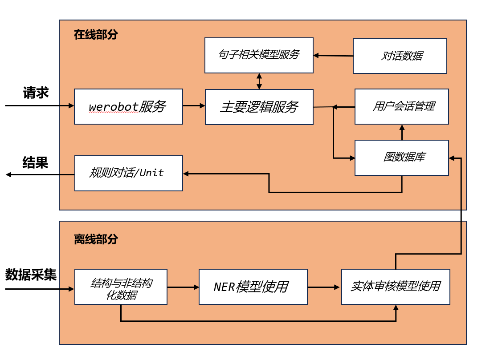
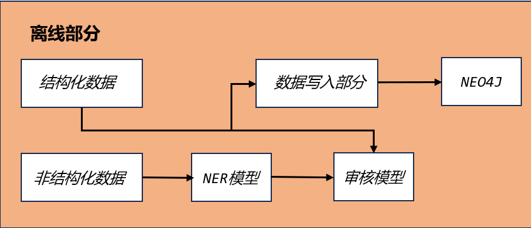
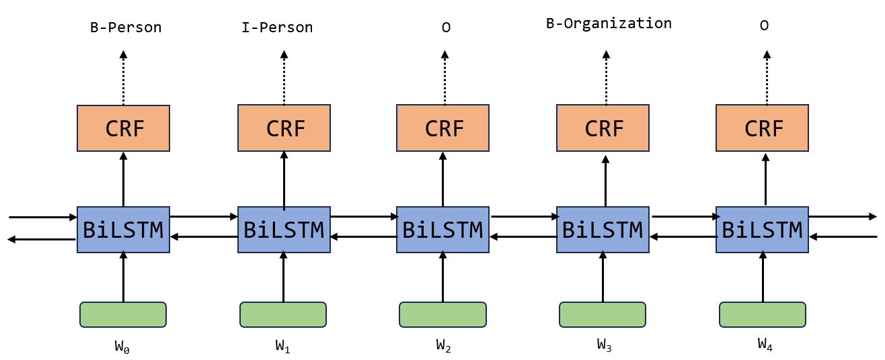
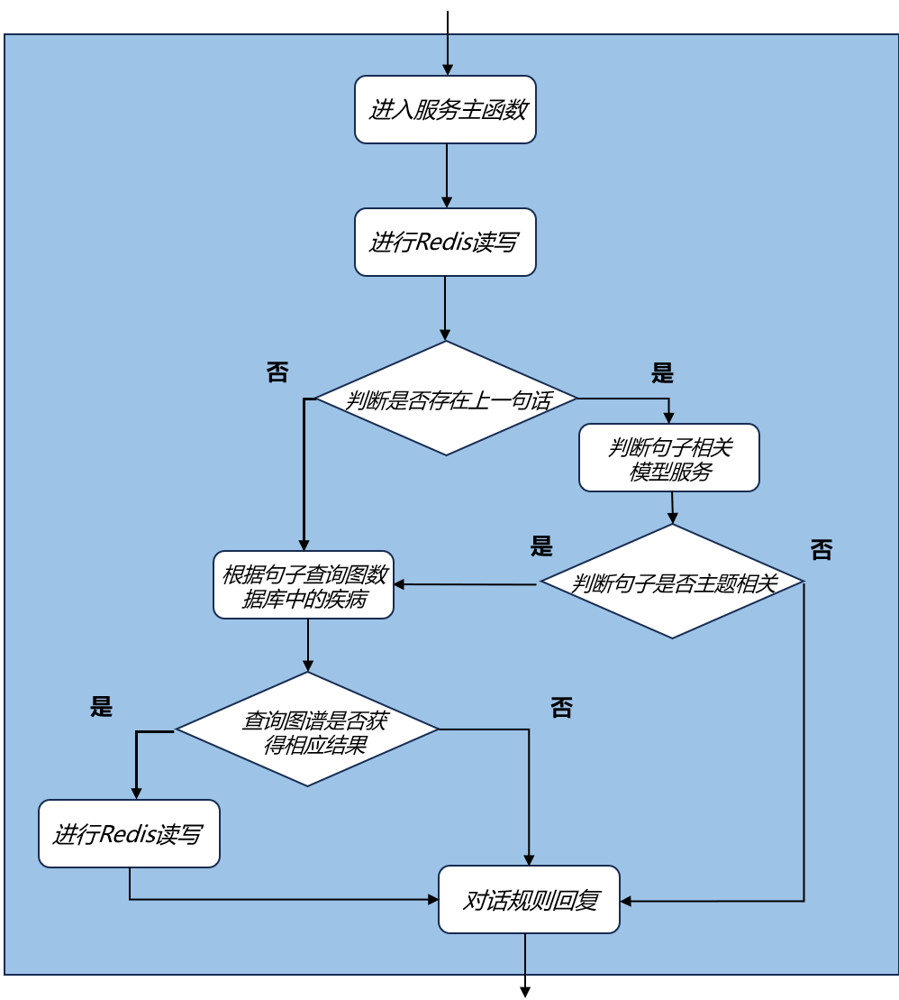

# 背景介绍

智能对话系统：一种基于人工智能技术，能够与用户进行自然语言交互的计算机程序。这种系统旨在模拟人类对话的能力，使计算机能够理解和生成自然语言，以有效地与用户进行交流。从处理问题的角度来区分，智能对话系统可以分为：

-   任务导向型:完成具有明确指向性的任务,比如预定酒店咨询,在线问诊等等。
-   非任务导向型:没有明确目的,比如算算术,播放音乐,回答问题。

我们的在线医生项目就是任务导向型的智能对话系统。

# 项目环境

# 总体架构

-   项目整体架构图

    

-   架构图分析
    -   整个项目分为:在线部分和离线部分
    -   在线部分包括:werobot服务模块,主要逻辑服务模块,句子相关模型服务模块,会话管理模块(redis),图数据库模块以及规则对话/Unit模块。
    -   离线部分包括:结构与非结构化数据采集模块, NER模型使用模块,以及实体审核模型使用模块。
    -   在线部分数据流:从用户请求开始,通过werobot服务,在werobot服务内部请求主服务,在主服务中将调用会话管理数据库redis,调用句子相关模型服务,以及调用图数据库,最后将查询结果输送给对话规则模版或者使用Unit对话API回复。
    -   离线部分数据流:从数据采集开始,将获得结构化和非结构化的数据,对于结构化数据将直接使用实体审核模型进行审核,然后写入图数据库;对于非结构化数据,将使用NER模型进行实体抽取,然后通过实体审核后再写入图数据库。

# 离线部分

-   离线部分架构展开图

-   离线部分简要分析:
-   根据架构展开图，离线部分可分为两条数据流水线，分别处理结构化数据和非结构化数据。
-   结构化数据流水线的组成部分:

    命名实体审核:对当前命名实体进行审核,来保证这些实体符合我们的要求。

    命名实体写入数据库:将审核后的命名实体写入数据库之中,供在线部分使用。

-   非结构化数据流水线的组成部分:

    命名实体识别:使用模型从非结构你文本中获取命名实体。

    命名实体审核:对当前命名实体进行审核,来保证这些实体符合我们的要求。

    命名实体写入数据库:将审核后的命名实体写入数据库之中,供在线部分使用。

## 4.1命名实体审核（AI_Doctor/doctor_offline/review_model）

-   NE审核任务:一般在实体进入数据库存储前,中间都会有一道必不可少的工序,就是对识别出来的实体进行合法性的检验,即命名实体(NE)审核任务。它的检验过程不使用上下文信息,更关注于字符本身的组合方式来进行判断,本质上，它是一项短文本二分类问题。
-   选用的模型及其原因:
-   针对短文本任务,无须捕捉长距离的关系,因此我们使用了传统的RNN模型来解决,性能和效果能达到很好的均衡。
-   短文本任务往往适合使用字嵌入的方式,但是如果你的训练集不是很大,涉及的字数有限,那么可以直接使用预训练模型的字向量进行表示即可。我们这里使用了bert-chinese预训练模型来获得中文汉字的向量表示。

## 4.2命名实体识别（AI_Doctor/doctor_offline/ner_model）

-   命名实体识别(Named Entity Recognition，NER)：就是从一段自然语言文本中找出相关实体，并标注出其位置以及类型。是信息提取,问答系统,句法分析,机器翻译等应用领域的重要基础工具,在自然语言处理技术走向实用化的过程中占有重要地位。包含行业,领域专有名词,如人名,地名,公司名,机构名,日期,时间,疾病名,症状名,手术名称,软件名称等。
-   命名实体识别的作用：
-   识别专有名词，为文本结构化提供支持。
-   主体识别，辅助句法分析。
-   实体关系抽取，有利于知识推理。
-   本项目采用BiLSTM+CRF模型进行命名实体识别：
-   BiLSTM+CRF模型结构：

    1.一个句子的词嵌入或字嵌入作为BiLSTM+CRF模型的输入，输出为句子中每个单元的标签。

2.模型内部的分层展开:整个模型明显有两层,第一层是BiLSTM层,第二层是CRF层。

3.CRF层的作用：如果没有CRF层，也可以训练一个BiLSTM命名实体识别模型，但是CRF能从训练数据中获取约束性的规则，可以为最后预测的标签是合法的。在训练数据训练的过程中，这些约束可以通过CRF层自动学习到。

-   损失函数的定义：

    BiLSTM层的输出维度是tag_size,也就是每个单词wi映射到tag的发射概率值,假设BiLSTM的输出矩阵是P,其中P(i,j)代表单词wi映射到tagj的非归一化概率。对于CRF层,假设存在一个转移矩阵A,其中A(i,j)代表tagj转移到tagi的概率。

    对于输入序列X对应的输出tag序列y,定义分数如下(本质上就是发射概率和转移概率的累加和):

    利用softmax函数,为每一个正确的tag序列y定义一个概率值,在真实的训练中,只需要最大化似然概率p(y\|X)即可,具体使用对数似然如下:

# 在线部分

-   在线部分简要分析:

根据架构图，在线部分的核心由三个服务组成，分别是werobot服务，主要逻辑服务，句子相关模型服务。这三个服务贯穿连接整个在线部分的各个模块。

-   werobot服务作用:

用于连接微信客户端与后端服务,向主要逻辑服务发送用户请求，接收结构返回给用户。

-   主要逻辑服务作用:

用于处理核心业务逻辑,包括会话管理，请求句子相关模型服务，查询图数据库，调用Unit API等。

-   句子相关模型服务:

用于封装训练好的句子相关判断模型,接收来自主要逻辑服务的请求,返回判断结果。

## 5.1主要逻辑服务（AI_Doctor/doctor_online/main_server）

-   主要逻辑图：

    

-   逻辑图分析
-   主要逻辑服务接收werobot发送的请求后，根据用户id查询redis查找用户上一次说过的话,根据结果判断是否为他的第一句。
-   如果是第一句话，直接查询数据库，判断句子中是否包含症状实体，并返回该症状连接的疾病，并填充在规则对话模版中，如果查询不到则调用Unit API返回结果。
-   如果不是该用户的第一句话,则连同上一句话的内容一起请求句子相关模型服务，判断两句话是否讨论同一主题,如果是,则继续查询图数据库，如果不是，使用unit api返回结果。

在AI_Doctor/doctor_online/main_server下运行：

gunicorn -w 1 -b 0.0.0.0:5001 app:app

\#w:开启的进程数

\#b:服务器IP地址和端口

\#app:app 是指执行的主要对象的位置，app.py中的app对象

## 5.2句子主题相关任务（AI_Doctor/doctor_online/bert_server）

-   句子主题相关任务:在多轮对话系统中,往往需要判断用户的最近两次回复是否围绕同一主题,来决定问答机器人是否也根据自己上一次的回复来讨论相关内容。在线医生问答过程中,同样需要这样的处理,确保用户一直讨论疾病有关的内容,来根据症状推断病情。这种任务的形式与判断两个句子是否连贯的形式相同,他们都需要输入两段文本内容,返回'是'或'否'的二分类标签。
-   选用的模型及其原因:对话系统是开放的语言处理系统,可能出现各种文字,当我们的训练集有限无法覆盖大多数情况时,可以直接使用预训练模型进行文字表示。我们这里使用了bert-chinese预训练模型,同时为了适应我们研究的垂直领域,我们在后面自定义浅层的微调模型,它将由两层全连接网络组成。
-   BERT中文预训练模型:;BERT模型整体架构基于Transformer模型架构, BERT中文预训练模型的解码器和编码器具有12层,输出层中的线性层具有768个节点,即输出张量最后一维的维度是768.它使用的多头注意力机制结构中,头的数量为12,模型总参数量为110M.同时,它在中文简体和繁体上进行训练,因此适合中文简体和繁体任务。
-   BERT中文预训练模型作用:在实际的文本任务处理中,有些训练语料很难获得,他们的总体数量和包含的词汇总数都非常少,不适合用于训练带有Embedding层的模型,但这些数据中却又蕴含这一些有价值的规律可以被模型挖掘,在这种情况下,使用预训练模型对原始文本进行编码是非常不错的选择,因为预训练模型来自大型语料,能够使得当前文本具有意义,虽然这些意义可能并不针对某个特定领域,但是这种缺陷可以使用微调模型来进行弥补。
